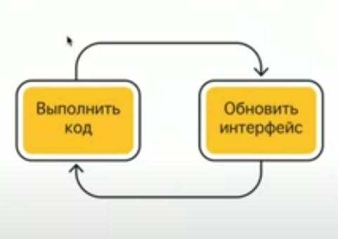
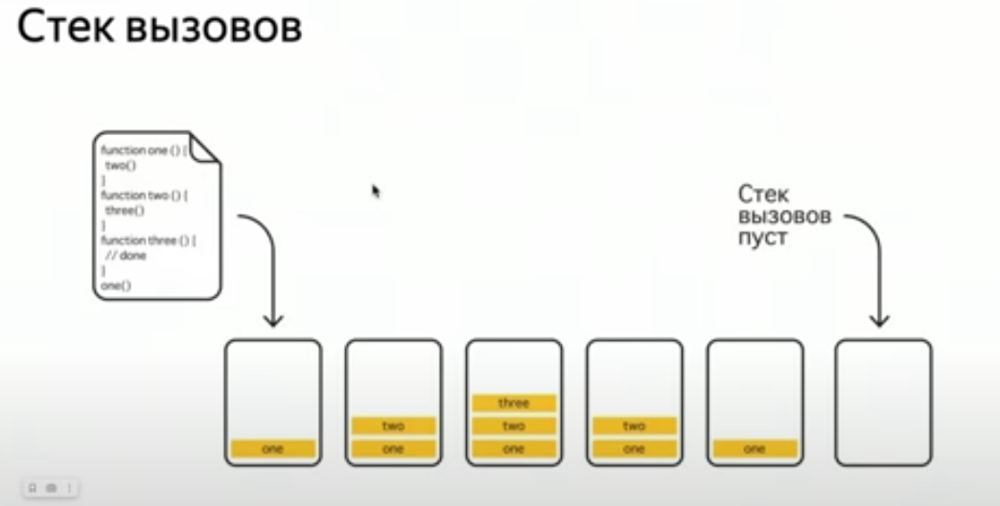
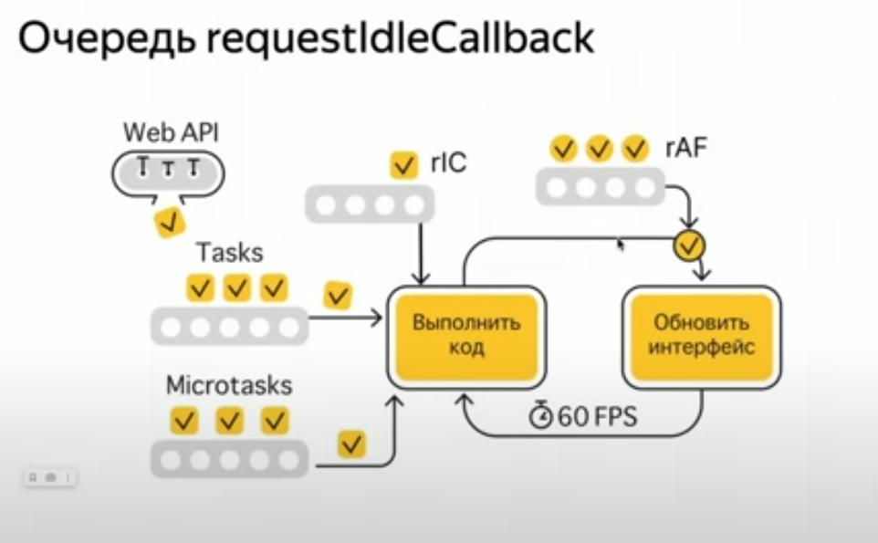
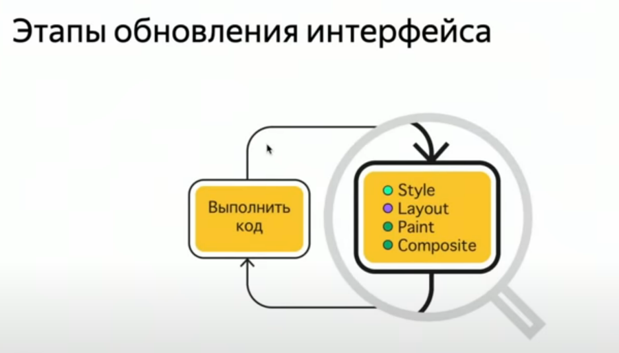

# JavaScript Related Questions

## Hosting, be able to create an example of it in code
- всплывает вар, всплывают function declaration
```javaScript
console.log(myFn(1, 2)) // 3

function myFn (a, b) {
	return a + b
}

console.log(myVar) // undefined

var myVar = 1
console.log(myVar) // 1
```
- не всплывают function expression, let, const
ошибку выдаст

## Closures, be able to create an example of it in code

- каждая функция

```js

const counter = (add: number) => {
  let count = 0

  return () => {
    count = count + add
    console.log(count); 
  }
}

const add1 = counter(1)
const add2 = counter(2)

const buttons = document.querySelectorAll(".button")
buttons[0].addEventListener("click", add1)
buttons[1].addEventListener("click", add2)
```

## Have solid understand why we use closures, how it is connected with encapsulation and IIFE

- IIFE больше не используется. потому что сейчас используют модули. каждый модуль имеет свою область видимости
- let и const имеют блочную область видимости что тоже упрощает работу с ними

поскольку var имеет функциональную область видимости, то использовали IIFE (Immediately Invoked Function Expressions) чтоб ограничит область видимости

мы можем использовать замыкания для инкапсуляции. например так доступ у значение переменной идет только через методы

```js
const fun = () => {
  let value = 0;

  return {
    setValue: (newVal: number) => value = newVal,
    getValue: () => value 
  }
}


const {getValue, setValue} = fun()
console.log(getValue()); // 0
setValue(setValue(4))
console.log(getValue()); // 4
```

## This keyword – basic idea, and its use in common and arrow function with examples

```js
const valera = {
  name: "valera"
}

const sasha = {
  name: "sasha"
}

function getName () {
  console.log(this.name);
}

valera.get = getName;
sasha.get = getName;

valera.get();  // выведет "valera"
sasha.get();   // выведет "sasha"
```

- function declaration имеют контекст объекта, в котором они вызываются. 
 - У стрелочной функции нет this. При получении значения this – оно, как обычная переменная, берётся из внешнего лексического окружения.

```js
const firstObj = {
  name: "DDD",
  BigFn: function () {
    return {
      arrow: () => {
        return {
          nestedArrow: () => {console.log(this)}
        }
        },
      fn: function () {
        console.log(this);
      }
    }
  }
}


const {arrow, fn} = firstObj.BigFn()
const {nestedArrow} = arrow()


const buttons = document.querySelectorAll(".button")
buttons[0].addEventListener("click", nestedArrow) // {name: 'DDD', BigFn: ƒ}
buttons[1].addEventListener("click", fn) // <button class="button not-white">Add 2</button>
```

## New keyword. How it works

new используется с функциями конструкторами. че она делает
- создает пустой объект и привязыыввает к нему контекст
- модифицирует этот объект
- возвразает его
```js
function User(name) {
  // this = {};  (неявно)

  // добавляет свойства к this
  this.name = name;
  this.isAdmin = false;

  // return this;  (неявно)
}
```
если вернуть что-то из конструктора, то это и вернется, вмеcто this
можно без скобок юзать, но не надо
```js
let user = new User; // <-- без скобок
// то же, что и
let user = new User();
```


## == comparison algorithm

- 1 если типы одинаковые, то сравнивается через ===
- если сравниваются null и undefined то вернется true
- если сравниваются строки, то приводятся к числам
- если сравниваются булианы, то приводятся к числам (true в 1, false в 0)
- если сравнивается объект, то сначала пробуется valueof, если его нет или он не примитив вернул то toString и алгоритм заново

## Priority of operations with example

есть таблица приоритетов. в ней 18 уровней вот основные из них
- операции в скобках
- унарные операции типа (+"1" - приведение  числу или ++i - префиксный инкремент. увеличение i на 1)
- умножение и деление
- сложение вычитание
- сравнение (<, <=, >, >=, ==, !=, ===, !==)
- логический И &&
- логический или ||
- присвоение (=, +=, -=)

## Have solid understanding of types auto conversion, what is unary, binary, ternary operations.

Приведение типов бывает явным (это ок). Это когда мы намеренно меняем тип. например строку перегоняем в число
бывает не явным, когда js автоматом приводит тип при определенных операциях например (это не ок)
```js
"2" + 2 // "22"
"2" * 2 // 4
```
- унарные операторы, это те которым нужен только один операнд (типа +"1")
- бинарный - которому нужный 2 операнда (типа 1 + 1)
- тернарный - три операнда isValid ? "black" : "white"


## Type of vs instance of show difference in examples.

typeof - это унарный оператор для определения типа. он вернет строку с типом операнда
```js
console.log(typeof 'Hello'); // 'string'
console.log(typeof 17); // 'number'
console.log(typeof true); // 'boolean'
console.log(typeof undefined); // 'undefined'
console.log(typeof {a: 1}); // 'object'
console.log(typeof [1, 2, 3]); // 'object'
console.log(typeof null); // 'object'
console.log(typeof function() {}); // 'function'
```

Оператор instanceof позволяет проверить, принадлежит ли объект указанному классу, с учётом наследования.
т.е. он бежит по цепочке прототипов и сравнивает, равен ли __proto__ прототипу класса

```js
class Rabbit {}
let rabbit = new Rabbit();

// это объект класса Rabbit?
alert( rabbit instanceof Rabbit ); // true

let arr = [1, 2, 3];
alert( arr instanceof Array ); // true
alert( arr instanceof Object ); // true

obj.__proto__ === Class.prototype?
obj.__proto__.__proto__ === Class.prototype?
obj.__proto__.__proto__.__proto__ === Class.prototype?
...
// если какой-то из ответов true - возвратить true
// если дошли до конца цепочки - false
```

## Prototype inheritance, props and cons, be able to realize

```js
class Valera {
  constructor(){}

  getValera(){
    console.log("VALERA");
  }
}

const valera1 = new Valera()
const valera2 = new Valera()

valera1.getValera() // VALERA
valera2.getValera() // VALERA

valera1.__proto__.getValera() // VALERA

Valera.prototype.getValera() // VALERA

valera1.__proto__ === Valera.prototype // true
console.log(valera1.toString());

console.log(Valera.__proto__ === Function.prototype); // true
console.log(Valera.__proto__.__proto__ === Object.prototype); // true

class Sasha extends Valera {
  constructor(){
    super()
  }

  getSasha(){
    console.log("SASHA");
  }
}

const sasha1  = new Sasha()
sasha1.getSasha() // SASHA
sasha1.getValera() // VALERA
```

## Primitive vs reference types with example. Pass by value vs pass by reference

Прототипное наследование - это форма наследования в JavaScript, где объекты наследуют свойства и методы от других объектов (их прототипов). 
плюсы 
- не надо дублировать код. наследуешься просто и можешь юзать все методы
- можно легко помняь свойство в прототипе и оно измениться у всех потомков

минусы
- сложность в определении this
- сложности в определиении что наследовать а что нет

## What is Promise, why should we use it. Promise vs async await, show similarity in examples

Промисы это способ работы в js с асинхронным кодом. мы должны их использовать для операций тредующих определенное время на выполненеи. например запросы или таймеры

```js
const promise = new Promise((res, rej) => {
  setTimeout(() => {
    res("success")
  }, 1000)
})


const promise2 = new Promise((res, rej) => {
  setTimeout(() => {
    rej("hm")
  }, 2000)
})

const b = async () => {
  const a =  await Promise.allSettled([promise, promise2])
  console.log(a);
}


b()

promise.then((a) => console.log(a));
promise2.catch((a) => console.log(a));
```

## Fetch api

```js
const getData = async () => {
  const res = await fetch('https://jsonplaceholder.typicode.com/posts')
  const data = await res.json()
  console.log({data});
} 

getData()

const postData = async (dataToSend: object) => {

  const body = JSON.stringify(dataToSend)
  const res = await fetch('https://jsonplaceholder.typicode.com/posts', {
    method: "POST",
    headers: {
       'Content-Type': 'application/json'
    },
    body
  })
  const data = await res.json()
  console.log({data});
} 

postData({name: 1})
```

## Basic DOM api: update, create, remove classes, attributes. Navigate through DOM tree. Be able to write recursive function to go throught DOM tree.

классы
- add добавляет новый класс к элементу.
- remove удаляет класс из элемента.
- toggle переключает класс (добавляет, если его нет, и удаляет, если он есть).
- contains проверяет, содержит ли элемент указанный класс.

атрибуты
- getAttribute(attrName): возвращает значение заданного атрибута.
- setAttribute(attrName, value): устанавливает значение заданного атрибута.
- removeAttribute(attrName): удаляет атрибут.
- hasAttribute(attrName): проверяет наличие атрибута, возвращает true или false.

навигачий по дому может быть по узлам или по элементам. 

```js
const domNavigator = (element: Element | null | undefined) => {
  if (!element) {
    return
  }

  console.log(element);
  if (element.firstElementChild) {
    domNavigator(element.firstElementChild)
  }
  if (element.nextElementSibling) {
    domNavigator(element.nextElementSibling)
  } 
}

const display = document.querySelector('.display')
domNavigator(display)
```

## How to add events. Capturing / Bubbling. Event delegation pattern. PreventDefault. Stop propagation. Stop propagation immediate.

- создаешь евент и диспатчишь его
словишь также как "click" только по тому имени что задал, типа "ce"
```js
const customEvent = new CustomEvent("ce", {
  detail: {
    name: "Marina"
  },
  bubbles: true
})

buttons[0].dispatchEvent(customEvent)
```
Capturing - погружение. событие начинается от корня документа и погружается к таргету, там срабатывает и начинает вспла=ывает обратно. обычно н аэтапе погружения его не ловят, но можно
Bubbling - всплытие. от таргета обратно к корню дома. на этой стадии его и ловят
delegation - если обработчик вешают не на кнопку меню. норм тема если меняется кол-во айтемов например, чтоб динамически не добавлять и снимать
PreventDefault - блокировка действия по умолчания. типа перезагрузки страницы по сабмиту
Stop propagation - остановка всплытия
Stop propagation immediate - остановка других обработчиков на этом же элементе на это же событие

## Differences between click, mousedown, mouseup, mouseover / mouseenter.

- клик это даун + ап
- маус овер - каждый раз срабатывает пока мышка над элементом проходит
- мас еэнтер только когда заходит на него

## BOM – navigation , history, location, LocalStorage, SessionStorage
Объектная можель - это предоставление дополнительных возможностей в виде объектов к которым предоставляется доступ
бразуеры предоставялют доступ к таким объектам как 


- history - навигация вперед назад и так далее
- screen - инфу о размере и вьюпорта и окна браузера
- location - дайет инфу о текужем положении типа паснейма, ориджина, серч параметров
- fetch - для запросов на сервер
- localStorage, sessionStorage -  для хранилок
-  navigator содержит информацию о браузере: название, версия, платформа, доступные плагины, доступ к буферу обмена и прочее. Это один из самых больших объектов в окружении.

## Even Loop with examples

вообще у браузера 2 задачи. выполнять код и обновлять интерфейс. js однопоточный, фазы постоянно меняются

сперва выполняется весь синхронный код по пронципу стека. задача попадает в стек, выполняется и уходит из него. если возвращает новую синхронную задачу, то она добавляется наверх, выполняется, уходит, потом первая уходит. как в стеке.

если в процессе выполнения синхнощины встречаются таймеры, то они попадают в очеред задачь. тудаже попадают события типа нажатия на кнопку браузера. Когда очередь до них дойдет, они попадут в стек вызовов

если встречаеются асинх эвейты и другие методы промисов, то они попадают в очередь микрозадач. она выполнится сразу после того как выполнится все из стека вызовов. причем цепочка выполниться полностью. если что-то новое появится то выполниться тоже

есть еще очередь реквестАйдлКолбек и реквест анимешн фрейм. РАФ пыполняется всегда перед рендером. причем если новое добавляется то идет уже на след круг. имеет определенное врмемя для выполнение на каждом тике

https://www.youtube.com/watch?v=XFn-nC-YZg8&list=PLRy0hmhjT9ncrA2FsQ0ScfEfdMnzS5bOU&index=26

https://www.jsv9000.app/



1 фаза - стек вызовов. вся синхронщина 




обновление интерфейса 


## For In vs For Of. What Is Symbol.Iterator. Create custom interator

## Interators vs Generators – at least basic knowledge

## Object descriptors. How for in loop works

## Rest operator (…) destruturing object properties

## Js Errors. Throw, catch, create custom errors.


# Optional:

## Immutable types, what it is and how it works under the hood.

## Critical rendering path

## RAF

## Function patterns: callback, memo, currying, chaining, IIFE, pipe

## How to create private property in js class

## Private property using WeakMap pattern

## Basics about drag/drop api