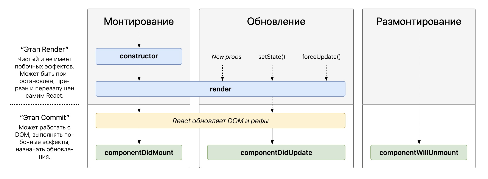

## Explain what is JSX.

Это синтаксическое расширение для javascript. Оно дает нам возможность писать код сразу похожим на html. это делает написание когда полее простым и понятны. по сути это синтаксический сахар для react.createElement

```js
const element = <h1>Hello, world!</h1>;

===

const element = React.createElement('h1', null, 'Hello, world!');
```

есть отличия от синтаксиса html. типа кэмелкейс для атрибутов, самозакрывающихся тегов, можно js писать прям внутри. 

## Unidirectional flow of Data?

данные в реакт передаются по однанаправленному потоку данных, от родителей к чайлду, через пропсы
- пропсы неизменные. их нельзя менять
- если нужно иметь общий стейт с сиблингами, то он рамещается в родителе

Преимущества однонаправленного потока данных:
Простота отслеживания данных:
Легче понять, откуда данные приходят и куда идут, поскольку они текут в одном направлении.

Упрощенная отладка:
Проще отлаживать компоненты, поскольку каждый компонент четко знает, откуда он получает свои данные и кто отвечает за их изменение.

Предсказуемость:
Так как данные передаются только сверху вниз, поведение приложения становится более предсказуемым.

Лучше масштабируемость:
Однонаправленный поток данных хорошо работает с большими и сложными приложениями, облегчая управление состоянием и данными.

## Class component vs functional component?

- это два подхода в написании компонентов
- сейчас более распространены функциональные. функциональные считаются более простыми

из различий кроме самого синтаксиса, у классовых стейт объявляется в конструкторе и находится в this.state. у функционального в хуке useState
плюс у классовых есть явные методы жизенного цикла, типа
componentDidMount - Вызывается сразу после монтирования компонента
componentShouldUpdate - Вызывается перед обновлением
componentDidUpdate - Вызывается сразу после обновления
componentWillUnmount - Вызывается перед размонтированием компонента

## Stateless and stateful components?

это просто компоненты с состоянием и без. если компонент получает что-то пропсами, как-то модифицирует и рендорит - это стейтлесс компонент

если внутри компонента вызван useState - и компонент редорит что-то в зависимости от него - стэйтфул компонент

## Prop vs State.

пропсы это параметры принятые в компонент от родителя. из нельзя менять
стэйт - это переменные хранящиеся внутри компонента. они хранятся сквозь рендеры. и их изменение вызывает ререндер компонента

## How setState method works?

асинхронно. если надо в сетстейте сделать операцию с пердыдущим значением, то передаем в него колбек, аргумент которого и будет текущий стейт. и возвращаем из колбека объект с тем ключем и значением, которое хотим поменять

важная штука, что в классовом компоненте один стейт на всеь компонент. чтоб присвоить полю нужное нам значание, мы передаем в сетствей объект только с этим полем
```js
this.setState({ name: 'Новое Имя' });
```
если в стете еще есть поле age, то оно не удалиться, все ок

## List and explain Lifecycle methods in React? Reflection in hooks. 



основные 
componentDidMount - Вызывается сразу после монтирования компонента (юз еффект с пустым массивом)
componentDidUpdate - Вызывается сразу после обновления - юзеффект с массивом зависимостей или вообще без ничего
componentWillUnmount - Вызывается перед размонтированием компонента - return из useEffect


## Why we need getDerivedStateFromProps and why this method is static? 

Этот метод нужен если мы меняем стэйт компонента при изменении его пропсов. Вообще это антипатерн, потому что считается что стейт должен меняться только внутри компонента. метод статический, чтоб он не имел доступ к this и не мог напрямую менять пропс или стейт. 

```js

static getDerivedStateFromProps(props, state) {
  if (props.selectedItem.id !== state.prevItemId) {
    return {
      selectedItem: props.selectedItem,
      prevItemId: props.selectedItem.id
    };
  }
  // Вернуть null если props не изменился
  return null;
}

```

## Which lifecycle methods we don’t have in hooks approach?

-  `getSnapshotBeforeUpdate`. Используется в тех случаях, когда необходимо зафиксировать некоторые данные из DOM перед тем как компонент обновится, то есть до того, как запись в DOM будет фактически применена. Это может быть полезно, например, при необходимости сохранить текущую позицию скролла пользователя перед тем, как добавить новые элементы в список и обновить компонент, чтобы затем вернуть пользователя к его исходной позиции.
можешь использовать useLayoutEffect

## Why will methods (except componentWillUnmount) become deprecated?

Методы жизненного цикла, начинающиеся с componentWill, такие как componentWillMount, componentWillUpdate и componentWillReceiveProps, объявлены устаревшими в React версии 17.

Это связано с следующими причинами:

Асинхронный рендеринг: Новый функционал React, включая асинхронный рендеринг, может вызывать эти методы несколько раз до того, как рендеринг фактически произойдет. Это может привести к различным багам и неэффективному коду.

Плохие практики: Эти методы жизненного цикла часто использовались неправильно или ввели разработчиков в заблуждение

Вместо них React предлагает другие методы, такие как getDerivedStateFromProps и componentDidUpdate

## Explain concept of Virtual DOM? Pros and cons of this approach?

обращения к реальному дому очень дорогие, поэтому в реакте есть концепция виртуального дома
- строится виртуальный дом. это облегченная версия реального ДОМа, в виде js объекта
- при внесении изменений строится полная копия такого вируального дома, находятся изменившиеся узлы.
- в тех местах, где произошли изменения, происходит Согласование с реальным домом и узлы в нем перерисовываются

плюсы - меньше запросов к дому
минусы - в больших списках или в работе с анимацией прироста производительности может не быть а дополнительные сложности могут присуствовать

## Re-render mechanism, DOM comparison and diff algorithm.

ререндер - это процесс перерисовки компонента. Ререндер реакт компонента еще не равен обновлению реального дома. если изменение нет по сравнению с предыдущей версией виртуального дома, то реальный обновлен не будет

сравнение происходит с применением diff алгоритма. 2 ключевых понятия в нем
- если тип элемента отличается - элемент будет снесен и его ветка полностью будет преестроена
- если типы одинаковые, то сравнивается атрибуты и свойствой элемнтов
после сравнения реакт рекурсивно пробегается по всем потомкам 

## How to handle events in React?

у наших JSX элементов которые мы создаем в метое ренедер есть атрибуты схожие с названиями событий для евентЛистенера. типа oClick onFocuse и так дале. кидаешь туда колбек, котрый первым аргументом примет объект события

## List and Keys? What will happen if we mark a couple of div’s with identical key property?

тут история какая, когда элементы сравниваются, то реакт пробегается по всем чайлдам и если они меняются, то генерит мутацию. которая потом полетит в реальный дом. Если добавить элемент в конец списка чайлдов, до будет создана 1 мутация для этого элемента. и все ок. Но если элемент добавить в начало списка, то реакт не поймет, что 1 элемент не изменился а просто стал вторым. поэтому следует добавляль ключи. так реакт поймет что добавился только 1 элемент в начало списка а остальные рередерить не надо.

ключи должны быть уникальные в рамках одного списка. если прям никак, и при этом порядок меняться не будет, то можно использовать индекс. Если же порядок будет менять и использовать индексы, то они тоже изменятся что может привести к неожиданным изменениям в интерфейсе.

Если у нескольких элементов будет один и тот же ключ, React не сможет корректно идентифицировать элементы для обновления или удаления.

Итогом может стать некорректное поведение приложения: данные могут отображаться неверно, состояние компонентов может сбиваться, а в React сломается механизм оптимизации повторного рендеринга.

## Presentational vs Container components?

это концепция в реакт по разделению компонентов на Персонализационные и контейнеры. 
Персонализационные не имеют доступа с стору, совоего состояния и прочего. они всю инфу получают через пропсы и нужны только для отображения интерфейса
Контейнеры хранят в себе состояния и дату из стора. прокидывают ее и колбеки для ее изменения пропсами в перезентационные

это надо для сохранения единой структуры, разделения ответственности, упрощения тестирования. но на практике с перехоам на ФП и появлением хуков эта концепция не так популярна

## What is Context in React?

это встроенный стейт менеджер. редакс на минималках. чтоб решить проблему пропс дрилинга создается оберртка (провайдер) вокруг поределенного кол-ва компонентов. и таким образом они через хук юз Контекст имеют доступ к общему к общему объекту. в этот же объект можно и колбек запихнуть для его изменения. Но изменения этого объекта ведер к ререндеру всех чайлдов. и в целом лучше юзать редакс

## What are Refs? Explain how they work?

Рефы, это способ обращаться к экземляру компонента в реальном доме. ты создаешь реф, прокидываешь его в свойство ref компонента и можешь например сетить на него фокус. или получать информацию о его положении на странице. может быть полезно для реализаций взяких форм или дропдаунов

в том числе можно с помощью useRef создать объекс, в свойстве current котторого хранть инфу изменение которой не приведет к ререндеру

## Describe error boundaries?

Для отлавливания ошибок внутри компонентов можно создать компонент - обертку ErrorBoundary. Его можно создать либо классовым либо с помощью кастомных хуков сторонних билиотек. если классами создавать, то Компонент можно назвать ErrorBoundary если в нем реализован один из этих методов или оба
```js
 class ErrorBoundary extends React.Component {
  constructor(props) {
    super(props);
    this.state = { hasError: false };
  }

  static getDerivedStateFromError(error) {
    // Обновить состояние с тем, чтобы следующий рендер показал запасной UI.
    return { hasError: true };
  }

  componentDidCatch(error, errorInfo) {
    // Можно также сохранить информацию об ошибке в соответствующую службу журнала ошибок
    logErrorToMyService(error, errorInfo);
  }

  render() {
    if (this.state.hasError) {
      // Можно отрендерить запасной UI произвольного вида
      return <h1>Что-то пошло не так.</h1>;
    }

    return this.props.children; 
  }
}

<ErrorBoundary>
  <MyWidget />
</ErrorBoundary>
```
Примечание

Предохранители не поймают ошибки в:

обработчиках событий (подробнее);
асинхронном коде (например колбэках из setTimeout или requestAnimationFrame);
серверном рендеринге (Server-side rendering);
самом предохранителе (а не в его дочерних компонентах).

## Explain what HOC is.

HOC или "Higher-Order Component" (компонент высшего порядка) в React - это функция, которая принимает компонент и возвращает новый компонент с добавленными или изменёнными свойствами
Но стоит учитывать, что с появлением хуков, многие кейсы использования HOC могут быть решены с помощью хуков, что может привести к более простому и понятному коду.


## What is React hooks?

это такие функции в реакте позволяющие работать с его функционалом. типа со стейтом или с жизненным циклом компонента. их можно использовать только на верхнеем уровне компонента, нельзя использовать кондишенали, можно использовать в кастомных хуках кастомные хукаи это функции изпользующие внутри себя другие хуки и возвращающие не react.node а что-то еще

## How to optimize performance of React Application?

держать стейт пониже
useMemo, useCallback
React.lazy = `const CatAvatar = React.lazy(() => import('./path/to/cat/avatar'));`
Выносите создание функций-обработчиков и объектов из JSX. Многие разработчики создают функции и объекты прямо в JSX. Это приводит к тому, что при каждом рендере создается новая функция или объект, что может вызвать ненужные повторные рендеры.


Optional:
## How Portals work in React? (optional)

позволяет рендорить компонент не чайлдом радителя а в другое место в документа. в createPortal первым аргументом передаешь компонент или jsx а вторым - узел куда его воткнуть. полезно когда надо избежать всяких overflow hidden. 

```js
import { createPortal } from 'react-dom';

function MyComponent() {
  return (
    <div style={{ border: '2px solid black' }}>
      <p>This child is placed in the parent div.</p>
      {createPortal(
        <p>This child is placed in the document body.</p>,
        document.body
      )}
    </div>
  );
}
```

## State management (Redux, Mobx) (at least one, optional)
## Unit testing in React, shallow render (maybe optional)