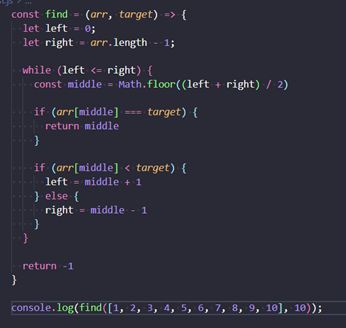
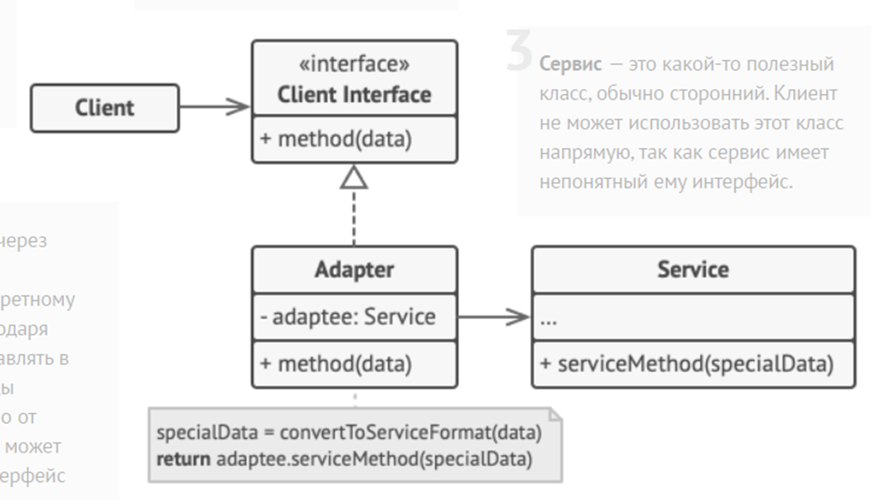
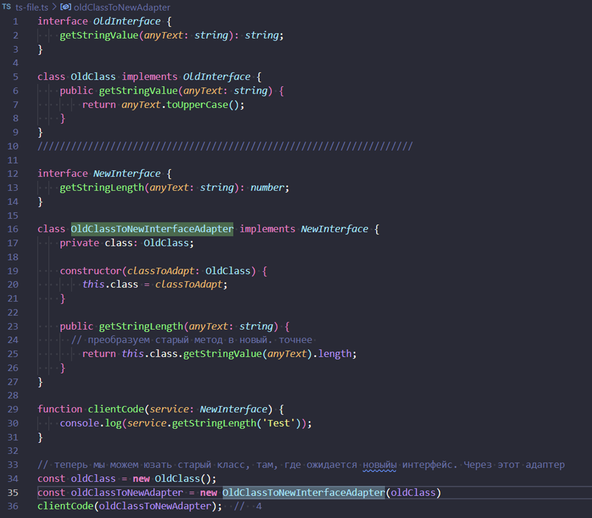

Извините за путаницу. Переведу вопросы в формат Markdown:

## Algorithms:
- **Explain at least one algorithm, how it works and complexity.**
  - Бинарный поиск. O(log n). (метод половинчатого деления). Работает только на отсортированном списке.

  

## Design Patterns:
- **GRASP vs GOF patterns, what the difference?**
  - GRASP – это скорее 9 принципов распределения обязанностей между классами и объектами в ООП. 
  - GOF – банда 4-х. 23 конкретных шаблона.
  вот принципы грасп
  Controller (Контроллер):

Контроллер управляет взаимодействием между пользователем и системой, принимает входные данные от пользователя и передает их в другие части системы для обработки.
Creator (Создатель):

Создатель отвечает за создание новых объектов. Этот шаблон используется для управления жизненным циклом объектов и уменьшения зависимостей между классами.
Information Expert (Эксперт по информации):

Эксперт по информации - это класс или объект, который обладает наибольшей экспертизой в решении конкретной задачи. Этот принцип помогает определить, где должна находиться функциональность в системе.
High Cohesion (Высокая связность):

Высокая связность означает, что элементы одного модуля должны быть сильно связаны между собой и иметь общую цель или задачу. Это помогает упростить понимание и поддержку кода.
Low Coupling (Низкая связность):

Низкая связность означает, что модули должны быть слабо связаны между собой. Это помогает создавать более гибкие и переносимые системы, так как изменения в одном модуле не должны приводить к изменениям в других модулях.

а банда 4-х про 20 с чем-то патернов разбитых на 3 категории

Порождающие паттерны (Creational Patterns):

Эти паттерны отвечают за механизмы создания объектов, обеспечивая гибкость при создании новых экземпляров классов или объектов. Некоторые из наиболее известных порождающих паттернов включают "Фабричный метод" (Factory Method), "Абстрактная фабрика" (Abstract Factory), "Строитель" (Builder) и "Прототип" (Prototype).
Структурные паттерны (Structural Patterns):

Эти паттерны связаны с компоновкой объектов и классов в более крупные структуры, обеспечивая более гибкое управление связями между объектами. Некоторые из наиболее известных структурных паттернов включают "Адаптер" (Adapter), "Мост" (Bridge), "Компоновщик" (Composite) и "Декоратор" (Decorator).
Поведенческие паттерны (Behavioral Patterns):

Эти паттерны определяют алгоритмы и взаимодействие между объектами, обеспечивая более гибкое управление поведением программы. Некоторые из наиболее известных поведенческих паттернов включают "Стратегию" (Strategy), "Наблюдатель" (Observer), "Состояние" (State) и "Цепочка обязанностей" (Chain of Responsibility).
- **Why we need design patterns?**
  - Это лучшие практики накопленные за много лет. Это помогает не изобретать решение проблемы, а классифицировать ее и подобрать уже готовое решение. Проще разбираться в чужом коде. Структурируют код, облегчая поддержку.
- **Do you know any cons of using design patterns?**
  - Увеличение времени на разработку. Иногда могут переусложнить код. Могут быть использованы неправильно. Ограничивают возможность придумать новое уникальное решение.
- **Choose one design pattern, draw diagram for this pattern, explain how it works.**
  - Адаптер.
  
  

## Semantic Versioning:
- **Explain what is SemVer.**
  - X.Y.Z – X – мажорная версия, Y – минорная, Z – патч.
- **Do we need SemVer on every project?**
  - Нет. Это может быть переусложнением, если это не нужно. Например, на маленьком личном проекте.
- **Explain brunch strategy on your project.**
  - Есть ветка мастера, от нее создаются ветки по названию сторей. Feature/US000001-add-new-input-design.
- **Imagine the following situation … (ex. you need swap last commits between two brunches) How you can deal with it?**
  - Чери пиком стягиваешь нужный коммит в нужную ветку (становишься на ветку и тянешь из другой).
- **How you can deal with merge conflicts?**
  - Можно руками. Можно автоматом в VS Code (принять новое, оставить старое, оставить оба).

## Code Style:
- **Why we need code styles?**
  - Повышение читаемости. Удобство совместной работы. Позволяет избегать некоторых ошибок (типа точек с запятой).
- **Which code style guide you using in your current project?**
  - eslint:recommended. Правила для TS, React, Next, a11y и несколько кастомных правил.

## DRY/KISS/YAGNI:
- **Explain what means DRY, KISS, YAGNI.**
  - Keep It Simple, Stupid.
  - Don't Repeat Yourself.
  - You Aren't Gonna Need It.
- **How you use them in day to day activities?**
  - DRY проверяется SonarQube. Но там обычно и так 0.
  - KISS – например, создаю константы в тестах, чтобы было понятнее.
  - YAGNI – просто делаю только то, что просят в сторе. Если хочу что-то добавить – обсуждаю с командой.

## SOLID:
- **Explain what every character in SOLID means.**
1. **Принцип единственной ответственности (Single Responsibility Principle)**:
   - Каждый класс должен иметь только одну причину для изменения. Этот принцип утверждает, что класс должен быть ответственным только за одну часть функциональности программы.

2. **Принцип открытости/закрытости (Open-Closed Principle)**:
   - Программные сущности, такие как классы, модули, функции, должны быть открыты для расширения, но закрыты для изменения. Это означает, что изменение поведения сущности должно происходить через добавление нового кода, а не изменение существующего.

3. **Принцип подстановки Лисков (Liskov Substitution Principle)**:
   - Объекты базового класса могут быть заменены экземплярами его подклассов без изменения корректности программы. Это означает, что поведение подклассов должно быть совместимым с поведением их родительского класса.

4. **Принцип разделения интерфейса (Interface Segregation Principle)**:
   - Клиенты не должны зависеть от интерфейсов, которые они не используют. Этот принцип утверждает, что интерфейсы должны быть маленькими и специфичными для конкретных задач, чтобы избежать нарушения зависимостей.

5. **Принцип инверсии зависимостей (Dependency Inversion Principle)**:
   - Высокоуровневые модули не должны зависеть от низкоуровневых модулей. Оба типа модулей должны зависеть от абстракций. Это означает, что код должен зависеть от абстракций, а не от конкретных реализаций, чтобы облегчить изменения и расширения программы.

## OOP v FP:
- **Main concepts of OOP.**
  - Наследуемость.
  - Инкапсуляция.
  - Полиморфизм.
- **Main concepts of FP.**
  - Pure Functions.
  - Immutability.
  - Higher-Order functions.
  - Рекурсия.
  - Функции первого класса.
  - Композиция.
- **FP vs OOP**
  - ООП больше подходит для создания больших и сложных систем, а ФП больше подходит для создания небольших компонентов многократного использования.

## Optional:
Структуры данных:
- **Binary Tree vs Search Tree**
  - Бинарное дерево: это дерево, где каждый узел имеет максимум два дочерних элемента, которые называются левым и правым дочерними элементами.
  - Дерево поиска: это бинарное дерево, в котором ключ в каждом узле должен быть больше всех ключей, хранящихся в левом поддереве, и меньше всех ключей в правом поддереве.
- **Stack vs Queue. Объясните базовый API обеих структур данных и как они работают.**
  - Стек: это структура LIFO (последний вошел - первый вышел). Основные операции включают push (добавление элемента), pop (удаление элемента) и peek (получение верхнего элемента без его удаления).
  - Очередь: это структура FIFO (первый вошел - первый вышел). Основные операции включают enqueue (добавление элемента), dequeue (удаление элемента) и peek (получение первого элемента без его удаления).
- **List vs Linked list. Объясните базовый API и как они работают.**
  - Список: это коллекция элементов, где каждый элемент занимает относительное положение по отношению к другим. Основные операции включают вставку, удаление, поиск и обновление.
  - Связанный список: это линейная структура данных, где каждый элемент является отдельным объектом. Каждый элемент (узел) списка состоит из двух частей - данных и ссылки на следующий узел. Основные операции включают вставку, удаление и обход.
- **Array vs List. В чем разница?**
  - Массив: это статическая структура данных, что означает, что размер массива должен быть объявлен при его создании и не может быть изменен позже. Он позволяет доступ к элементам на основе их индекса, который является числовым значением.
  - Список: это динамическая структура данных, что означает, что размер списка может изменяться во время выполнения программы. Он позволяет доступ к элементам на основе их положения в списке.
- **Hash-table, как это работает? Объясните базовый API, коллизии.**
  - Хеш-таблица: это структура данных, которая реализует абстрактный тип данных ассоциативного массива, структуру, которая может отображать ключи на значения. Хеш-таблица использует хеш-функцию для вычисления индекса в массиве корзин или слотов, из которых можно найти нужное значение. Основные операции включают put (вставка), get (получение) и remove (удаление).
  - Коллизия: коллизия происходит, когда два разных ключа хешируются в один и тот же индекс в массиве. Это обычно обрабатывается с помощью цепочек (когда каждый слот массива содержит связный список элементов, хешированных в этот слот) или открытой адресации (когда коллизия приводит к пробингу других слотов в массиве до тех пор, пока не найден свободный слот).

Алгоритмы:
- **Как измерить сложность алгоритма? Большая нотация O.**
  - Сложность алгоритма измеряется как количество времени и/или пространства, требуемое алгоритмом, в зависимости от размера входных данных. Обычно это выражается с помощью большой нотации O, которая описывает верхнюю границу сложности в худшем случае. Например, алгоритм, требующий перебора всех элементов массива, можно сказать, что имеет сложность O(n), где n - размер массива.